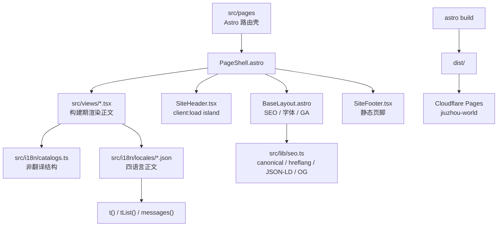
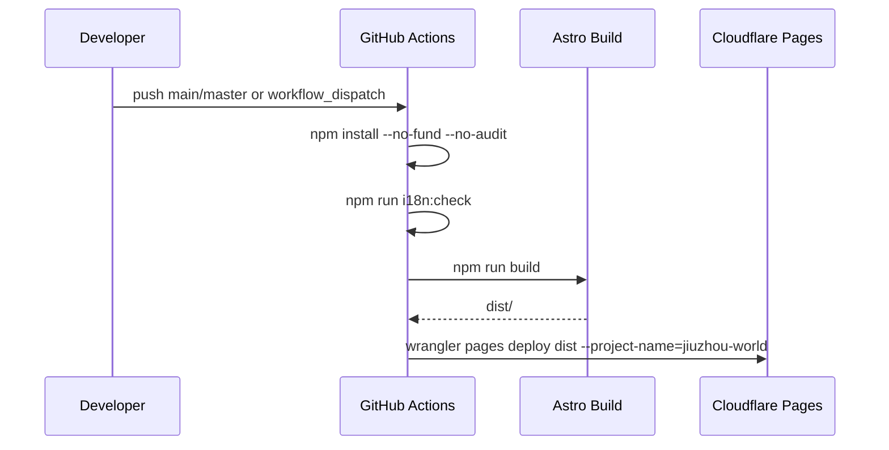

# Architecture

九州志是一个 **Astro 5 static output** 站点。页面在构建期生成静态 HTML；正文视图以 React 组件表达，但不在客户端整页水合。客户端运行时主要集中在 `SiteHeader`：滚动隐藏、移动菜单与语言切换。

## 主要边界

### 路由层：`src/pages/`

- 中文默认无前缀：`/`、`/about`、`/contribute`、`/linan/*`。
- 非默认语言走平行路由树：`/[locale]/...`，由 `localeStaticPaths()` 生成 `en / ja / ko`。
- 每个页面只做三件事：取 `seo`、锁定 `lang`、把对应 view 放进 `PageShell`。

### 布局层：`src/layouts/`

- `BaseLayout.astro`：加载全局 CSS、字体、SEO meta、canonical、hreflang、JSON-LD、Google Analytics。
- `PageShell.astro`：组合 `SiteHeader client:load`、正文 slot、`SiteFooter`，并根据当前路径生成 header copy。

### 视图层：`src/views/`

- `Home.tsx`、`About.tsx`、`ContributeHub.tsx`、`ContributePlace.tsx` 是全站级页面主体。
- `src/views/linan/*` 是临安卷章节：`LinanHome`、`Mountains`、`Scenic`、`History`、`Culture`。
- 视图组件通过 `messages(lang)` 取文案，通过 `withLocale()` 生成语言正确的链接。

### 组件层：`src/components/`

- `SiteHeader.tsx` 是唯一明确水合的交互岛：滚动状态、隐藏状态、移动菜单、语言下拉。
- `Reveal`、`ParallaxImage`、`PageHero`、`MiniTitle`、`Seal`、`SiteFooter` 等用于静态展示与视觉结构。

### 内容与 i18n：`src/i18n/`

- `config.ts` 定义 `LOCALES = zh/en/ja/ko`、默认语言 `zh`、字体与 hreflang 元信息。
- `catalogs.ts` 保存不翻译的结构：卷、章节、景点、图片、供图城市、SEO 页面清单。
- `locales/*.json` 保存四语言正文；中文是 canonical key tree。
- `t.ts` 当前语言优先，缺失或空值回退中文。

### SEO 与路径工具：`src/lib/`

- `i18n-path.ts` 负责去除 / 添加语言前缀、语言检测、静态语言路径。
- `seo.ts` 负责 canonical、hreflang、OG、Twitter card、JSON-LD，以及临安页面的 `Place` 结构化数据。
- `header-copy.ts` 为 Header 提供当前语言、当前路径与双语小字。

## 部署边界

CI 需要 `CLOUDFLARE_API_TOKEN` 与 `CLOUDFLARE_ACCOUNT_ID`。
