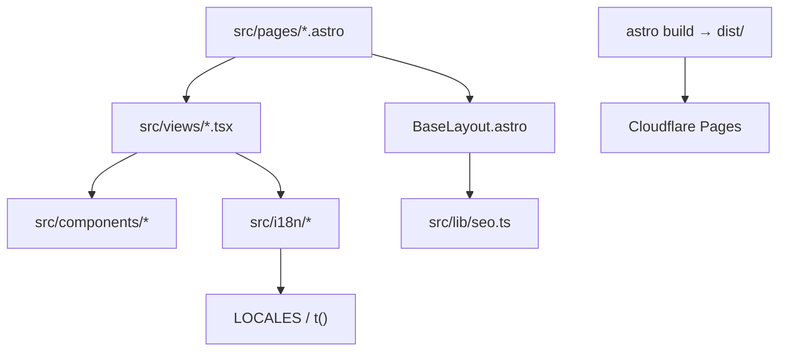

# System architecture

静态 Astro 站点 + React islands。内容与路由按语言拆分，页面壳在 Astro，交互视图在 React。

## 模块边界
- **pages**：路由入口；默认中文无前缀，其他语言走 `/[locale]/…`
- **views**：页面级 React 组合（Home、About、临安各章）
- **i18n**：文案按语言分 JSON（`src/i18n/locales/{zh,en,ja,ko}.json`）；`t(key, lang)` 读取，回退 lang → en → zh。四语正文齐全。印章、卷次、拉丁名留在 catalogs / 组件里，不进 locale 文件
- **lib**：路径与 SEO 工具
- **components**：站点壳与 UI 原语（含 shadcn 风格 ui/）

## 部署
GitHub Actions 构建后由 Wrangler 部署到 Cloudflare Pages（`jiuzhou-world`）。
