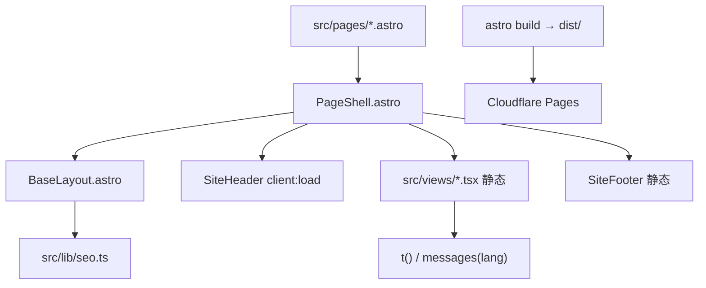

# System architecture

静态 Astro 站点。正文在构建期渲染成 HTML，不整页水合。只有顶栏（收起、换语言、菜单）是 React island（client:load）。Reveal / 满幅图用 CSS，不挂脚本。

## 模块边界
- **pages**：路由入口；默认中文无前缀，其他语言走 `/[locale]/…`
- **PageShell**：顶栏小岛 + 静态页脚 + 正文 slot
- **views**：页面级 React，构建期出 HTML，运行时不水合
- **i18n**：文案按语言分 JSON；`t(key, lang)` / `messages(lang)`，回退当前语言 → 中文。刊头小字中文页配英文，其余配中文
- **lib**：路径与 SEO 工具
- **components**：顶栏可交互；其余组件静态输出

## 部署
GitHub Actions 先跑 `npm run i18n:check`，再构建，由 Wrangler 部署到 Cloudflare Pages（`jiuzhou-world`）。
