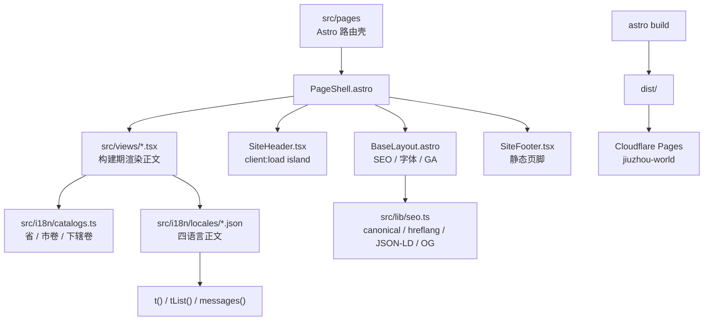
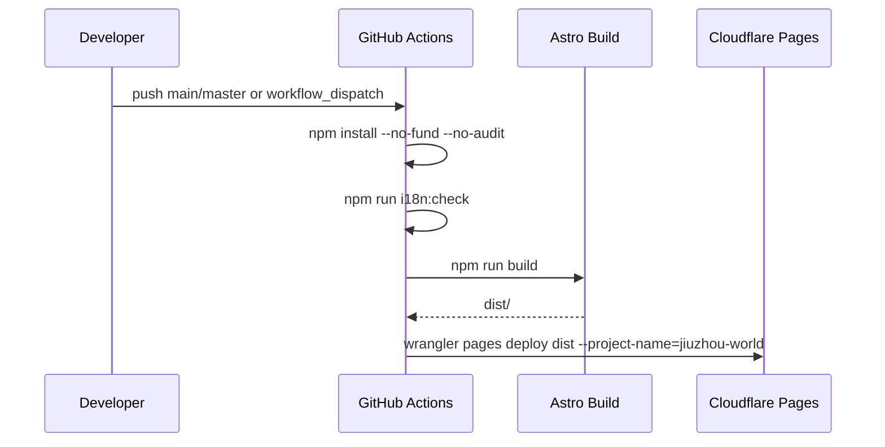

# System architecture

九州志是一个 **Astro 5 static output** 站点。页面在构建期生成静态 HTML；正文视图以 React 组件表达，但不在客户端整页水合。客户端运行时主要集中在 `SiteHeader`：滚动隐藏、移动菜单与语言切换。

内容层级与读法见 [[anthology-spine]]，不在本页展开。

```mermaid
graph TD
  Pages["src/pages\nAstro 路由壳"] --> Shell["PageShell.astro"]
  Shell --> Layout["BaseLayout.astro\nSEO / 字体 / GA"]
  Shell --> Header["SiteHeader.tsx\nclient:load island"]
  Shell --> Views["src/views/*.tsx\n构建期渲染正文"]
  Shell --> Footer["SiteFooter.tsx\n静态页脚"]
  Views --> Catalogs["src/i18n/catalogs.ts\n省 / 市卷 / 下辖卷"]
  Views --> Messages["src/i18n/locales/*.json\n四语言正文"]
  Messages --> T["t() / tList() / messages()"]
  Layout --> SEO["src/lib/seo.ts\ncanonical / hreflang / JSON-LD / OG"]
  Build["astro build"] --> Dist["dist/"]
  Dist --> CF["Cloudflare Pages\njiuzhou-world"]
```

## 主要边界

### 路由层：`src/pages/`

中文默认无前缀。非默认语言走平行树 `/[locale]/...`（`en / ja / ko`）。

- 全站：`/`、`/about`、`/contribute`
- 省：`/zhejiang`（导航，无正文）
- 市卷：`/hangzhou`、`/hangzhou/{mountains,scenic,culture,history}`
- 下辖卷：`/hangzhou/linan`、`/hangzhou/linan/{mountains,scenic,culture,history,contribute}`
- 旧 `/linan/*` 301 到 `/hangzhou/linan/*`
- 杭州供图 `/hangzhou/contribute` 已定、尚未做页，见 [[photo-contribute]]

每个页面只做三件事：取 `seo`、锁定 `lang`、把对应 view 放进 `PageShell`。

### 布局层：`src/layouts/`

- `BaseLayout.astro`：全局 CSS、字体、SEO meta、canonical、hreflang、JSON-LD、Google Analytics。
- `PageShell.astro`：`SiteHeader client:load`、正文 slot、`SiteFooter`，按路径生成 header copy。

### 视图层：`src/views/`

- 全站：`Home`、`About`、`ContributeHub`、`ContributePlace`
- 省：`ProvinceHome`
- 卷：`VolumeHome`（杭州 / 临安共用）
- 章：`Mountains`、`Scenic`、`History`、`Culture`（按 `volume` 取 catalog + 文案）

内部章 key 仍是 `mountains / scenic / culture / history`；中文标签为山川 / 景 / 物 / 史，见 [[chapter-skeleton]]。

### 组件层：`src/components/`

- `SiteHeader.tsx` 是唯一明确水合的交互岛。
- `Reveal`、`ParallaxImage`、`PageHero`、`MiniTitle`、`Seal`、`SiteFooter` 等用于静态展示。

### 内容与 i18n：`src/i18n/`

- `config.ts`：`LOCALES = zh/en/ja/ko`，默认 `zh`。
- `catalogs.ts`：省、市卷、下辖卷、章节、条目、供图、SEO 清单。不翻译。
- `locales/*.json`：四语言正文；中文是 canonical key tree。
- `t.ts`：当前语言优先，空值回退中文。

### SEO 与路径：`src/lib/`

- `i18n-path.ts`：去 / 加语言前缀。
- `seo.ts`：canonical、hreflang、OG、JSON-LD。
- `header-copy.ts`：当前语言、路径、双语小字。

## 部署边界

```mermaid
sequenceDiagram
  participant Dev as Developer
  participant GH as GitHub Actions
  participant Astro as Astro Build
  participant CF as Cloudflare Pages
  Dev->>GH: push main/master or workflow_dispatch
  GH->>GH: npm install --no-fund --no-audit
  GH->>GH: npm run i18n:check
  GH->>Astro: npm run build
  Astro-->>GH: dist/
  GH->>CF: wrangler pages deploy dist --project-name=jiuzhou-world
```

CI 需要 `CLOUDFLARE_API_TOKEN` 与 `CLOUDFLARE_ACCOUNT_ID`。
