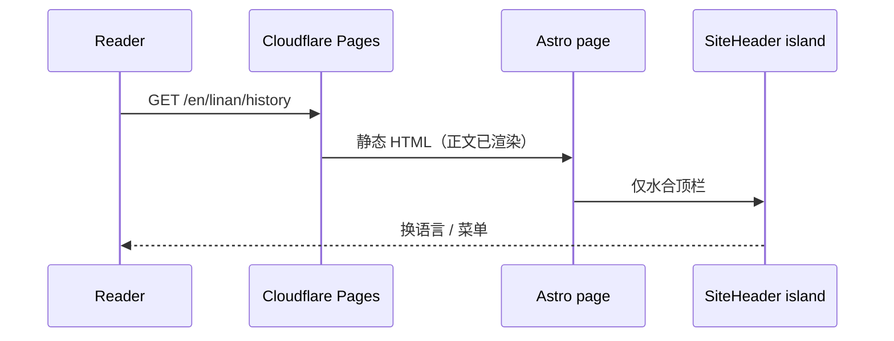

# Key flows

典型请求：读者打开某语言下的临安章节页。

正文不经过客户端 React。缺文案在构建期按 lang → en → zh 回退写进 HTML。

## 构建与发布
1. push `main` → GitHub Actions
2. `npm run i18n:check` → `npm run build` → `dist/`
3. `wrangler pages deploy dist --project-name=jiuzhou-world`
