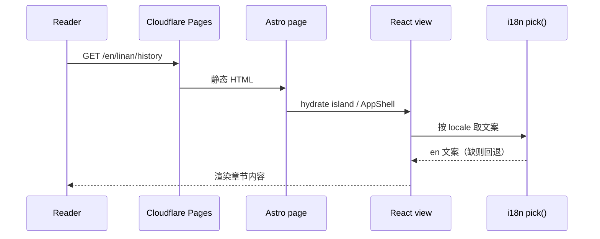

# Key flows

典型请求：读者打开某语言下的临安章节页。

```mermaid
sequenceDiagram
  participant U as Reader
  participant CDN as Cloudflare Pages
  participant HTML as Astro page
  participant V as React view
  participant I as i18n pick()
  U->>CDN: GET /en/linan/history
  CDN->>HTML: 静态 HTML
  HTML->>V: hydrate island / AppShell
  V->>I: 按 locale 取文案
  I-->>V: en 文案（缺则回退）
  V-->>U: 渲染章节内容
```

## 构建与发布
1. push `main` → GitHub Actions
2. `npm install` → `npm run build` → `dist/`
3. `wrangler pages deploy dist --project-name=jiuzhou-world`
