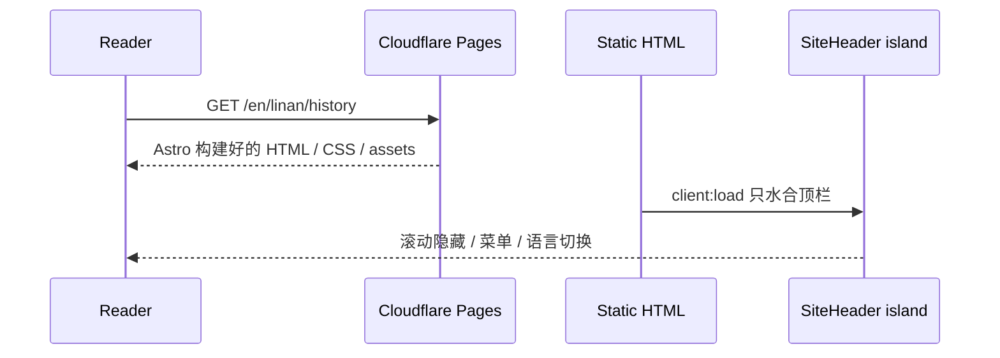
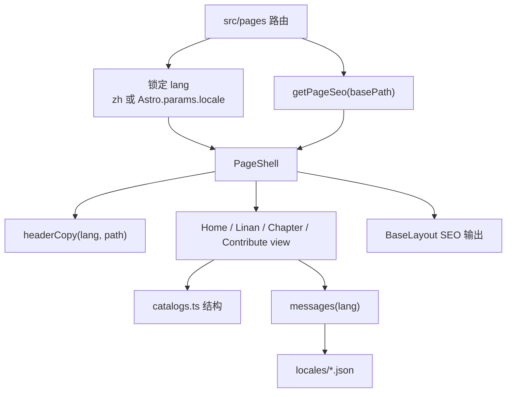
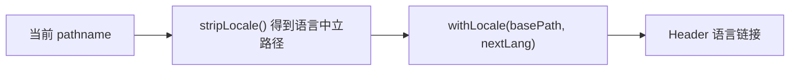
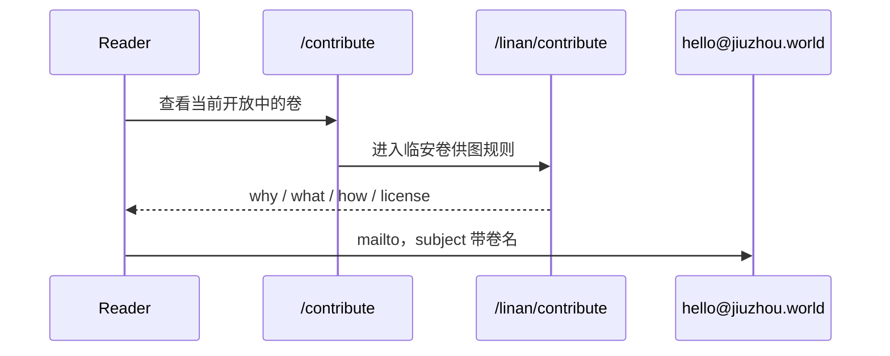
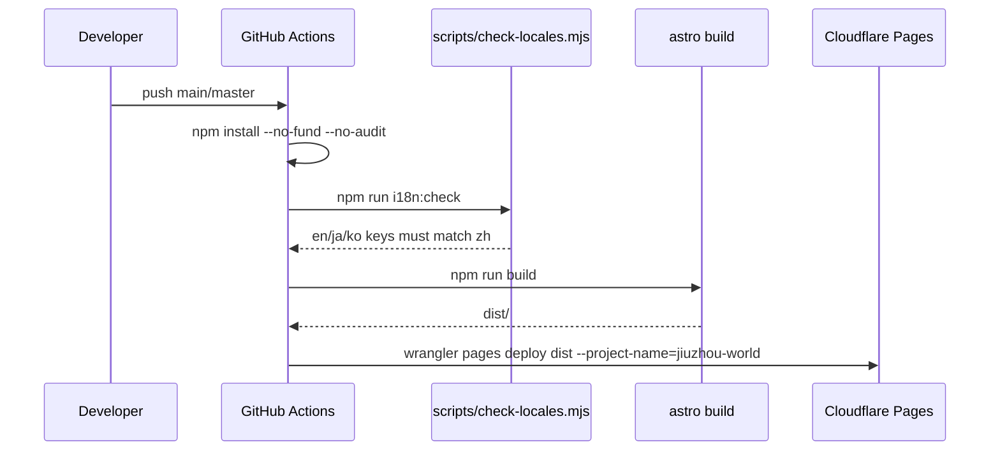

# Key Flows

## 1. 读者打开一个多语言章节页

典型例子：读者访问 `/en/linan/history`。

关键点：

- 正文由 Astro 在构建期渲染，不依赖客户端 React 才能阅读。
- `BaseLayout` 在 HTML head 写入 canonical、hreflang、OG、JSON-LD 与字体。
- `SiteHeader` 是主要客户端交互层；正文 reveal、Ken Burns、hover zoom 等主要由 CSS 完成。

## 2. 页面生成流程

## 3. 语言切换流程

规则：

- 中文是默认语言，不加 `/zh`。
- `en / ja / ko` 加语言前缀。
- `hreflang` 包含 `zh-CN / en / ja / ko / x-default`，其中 `x-default` 指向中文。

## 4. 供图流程

产品约束：供图按“一卷一城”拆分标准。全站总入口只列出开放卷；每一卷自己的 `/{city}/contribute` 才写完整规则。

## 5. 构建与发布流程

`check-locales.mjs` 把 `zh.json` 当 canonical key tree；`en / ja / ko` 缺 key 或多 key 都会让 CI 失败。
