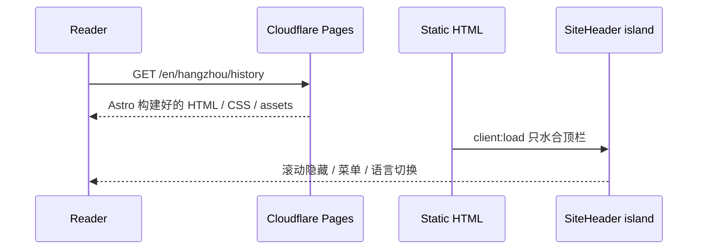
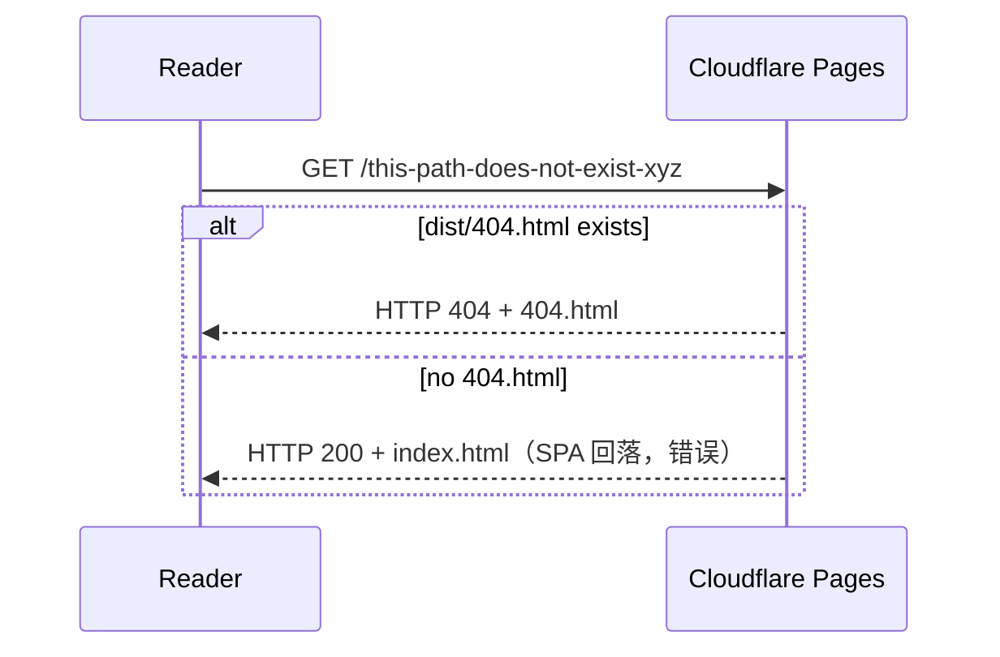
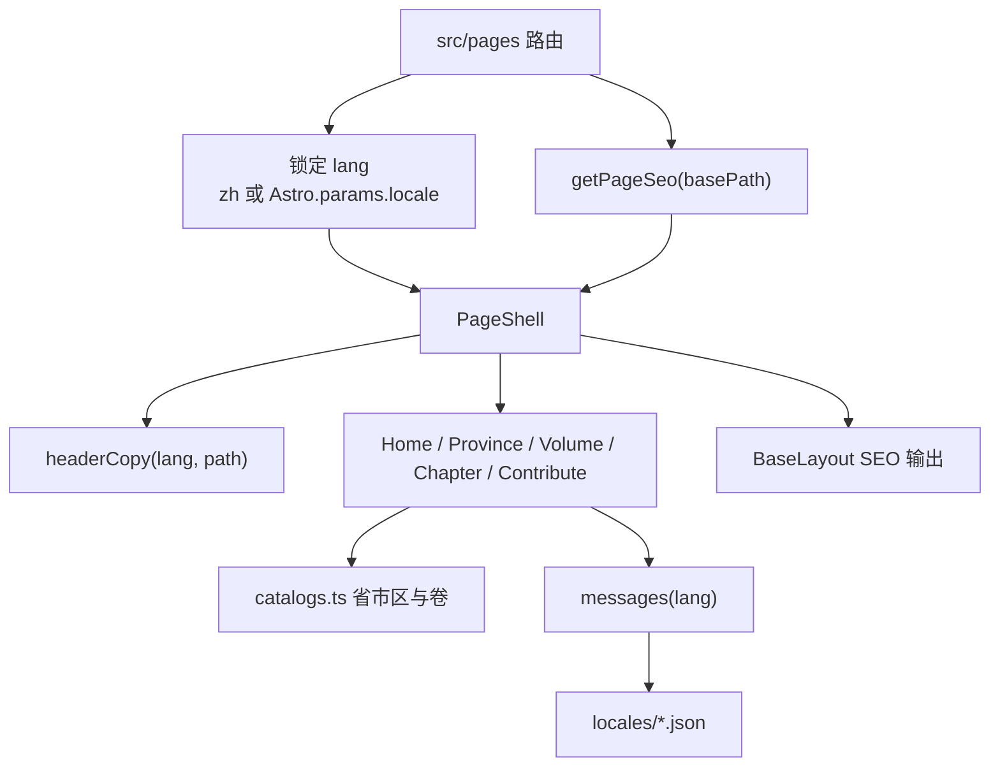
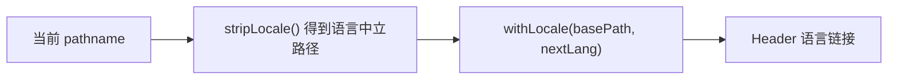
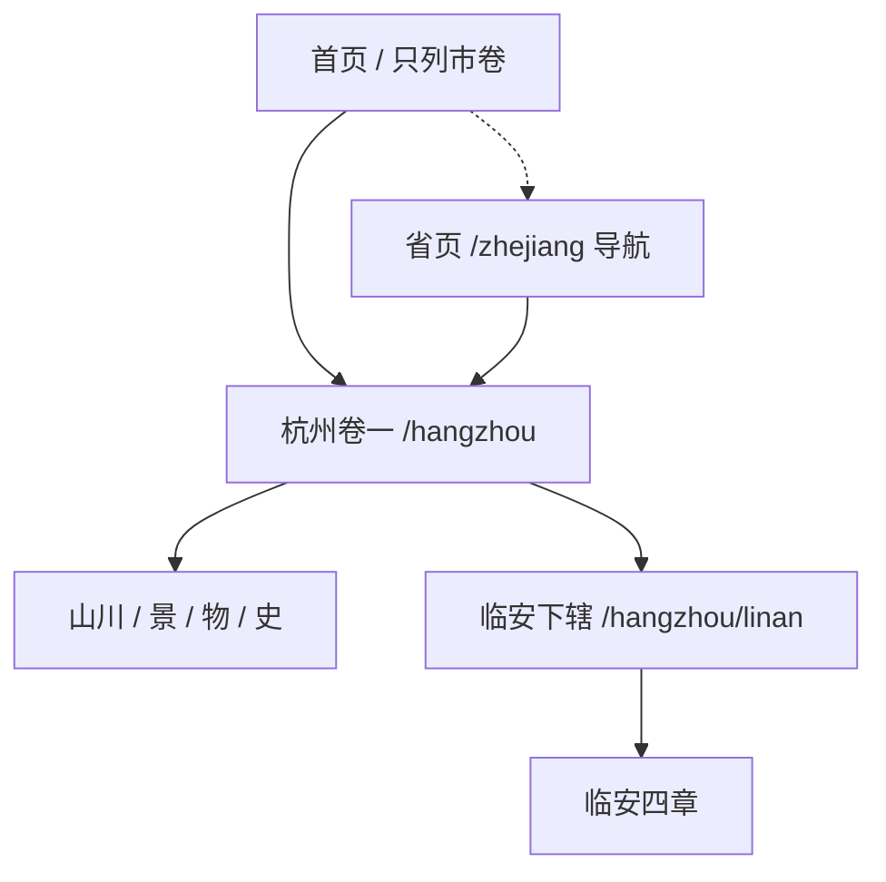
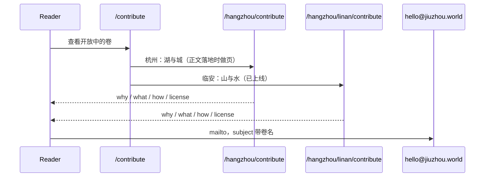
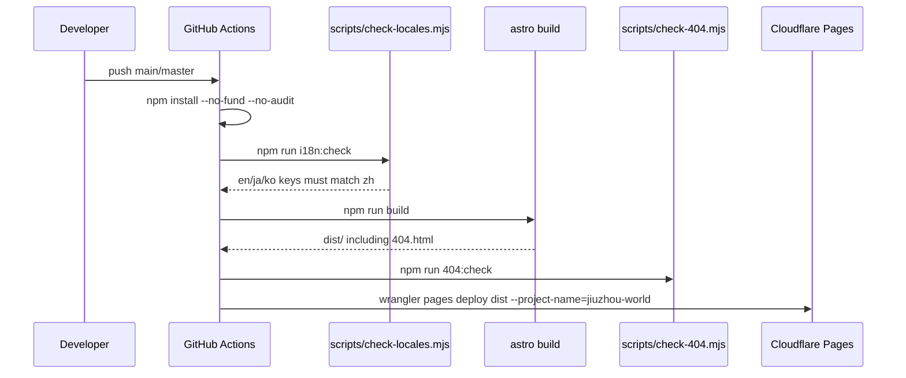

# Key flows

## 1. 读者打开一个多语言章节页

典型例子：读者访问 `/en/hangzhou/history`。

```mermaid
sequenceDiagram
  participant U as Reader
  participant CDN as Cloudflare Pages
  participant HTML as Static HTML
  participant H as SiteHeader island
  U->>CDN: GET /en/hangzhou/history
  CDN-->>U: Astro 构建好的 HTML / CSS / assets
  HTML->>H: client:load 只水合顶栏
  H-->>U: 滚动隐藏 / 菜单 / 语言切换
```

关键点：

- 正文由 Astro 在构建期渲染，不依赖客户端 React 才能阅读。
- `BaseLayout` 在 HTML head 写入 canonical、hreflang、OG、JSON-LD 与字体。
- `SiteHeader` 是主要客户端交互层；正文动效主要由 CSS 完成。
- 下辖卷路径是 `/hangzhou/linan/...`；旧 `/linan/...` 301 过来。

## 2. 未知路径必须 404

```mermaid
sequenceDiagram
  participant U as Reader
  participant CDN as Cloudflare Pages
  U->>CDN: GET /this-path-does-not-exist-xyz
  alt dist/404.html exists
    CDN-->>U: HTTP 404 + 404.html
  else no 404.html
    CDN-->>U: HTTP 200 + index.html（SPA 回落，错误）
  end
```

真实页面与资源保持 200。不要把未知路径 200/301 到首页。见 [[unknown-paths-http-404]]。

## 3. 页面生成流程

```mermaid
flowchart TD
  Route["src/pages 路由"] --> SEO["getPageSeo(basePath)"]
  Route --> Lang["锁定 lang\nzh 或 Astro.params.locale"]
  Lang --> Shell["PageShell"]
  SEO --> Shell
  Shell --> HeaderCopy["headerCopy(lang, path)"]
  Shell --> View["Home / Province / Volume / Chapter / Contribute"]
  View --> Catalogs["catalogs.ts 省市区与卷"]
  View --> Locale["messages(lang)"]
  Locale --> JSON["locales/*.json"]
  Shell --> Layout["BaseLayout SEO 输出"]
```

404 不走 `getPageSeo`：未知 path 会回退成首页 SEO。

## 4. 语言切换流程

```mermaid
flowchart LR
  Current["当前 pathname"] --> Strip["stripLocale() 得到语言中立路径"]
  Strip --> With["withLocale(basePath, nextLang)"]
  With --> Link["Header 语言链接"]
```

规则：

- 中文是默认语言，不加 `/zh`。
- `en / ja / ko` 加语言前缀。
- `hreflang` 包含 `zh-CN / en / ja / ko / x-default`，其中 `x-default` 指向中文。

## 5. 下行阅读

```mermaid
flowchart TD
  Home["首页 / 只列市卷"] --> HZ["杭州卷一 /hangzhou"]
  Home -.-> ZJ["省页 /zhejiang 导航"]
  ZJ --> HZ
  HZ --> Ch["山川 / 景 / 物 / 史"]
  HZ --> LA["临安下辖 /hangzhou/linan"]
  LA --> ChL["临安四章"]
```

古州身份：省页 kicker「古扬州之南」；首页市卷卡小字「古扬州之地」。卷首 kicker 只写今制。见 [[root-pulse-mountains-rivers]]。

## 6. 供图流程

```mermaid
sequenceDiagram
  participant R as Reader
  participant Hub as /contribute
  participant HZ as /hangzhou/contribute
  participant LA as /hangzhou/linan/contribute
  participant Mail as hello@jiuzhou.world
  R->>Hub: 查看开放中的卷
  Hub->>HZ: 杭州：湖与城（正文落地时做页）
  Hub->>LA: 临安：山与水（已上线）
  HZ-->>R: why / what / how / license
  LA-->>R: why / what / how / license
  R->>Mail: mailto，subject 带卷名
```

见 [[photo-contribute]]。

## 7. 构建与发布流程

```mermaid
sequenceDiagram
  participant Dev as Developer
  participant CI as GitHub Actions
  participant Check as scripts/check-locales.mjs
  participant Build as astro build
  participant Guard as scripts/check-404.mjs
  participant CF as Cloudflare Pages
  Dev->>CI: push main/master
  CI->>CI: npm install --no-fund --no-audit
  CI->>Check: npm run i18n:check
  Check-->>CI: en/ja/ko keys must match zh
  CI->>Build: npm run build
  Build-->>CI: dist/ including 404.html
  CI->>Guard: npm run 404:check
  CI->>CF: wrangler pages deploy dist --project-name=jiuzhou-world
```

`check-locales.mjs` 把 `zh.json` 当 canonical key tree；`en / ja / ko` 缺 key 或多 key 都会让 CI 失败。
