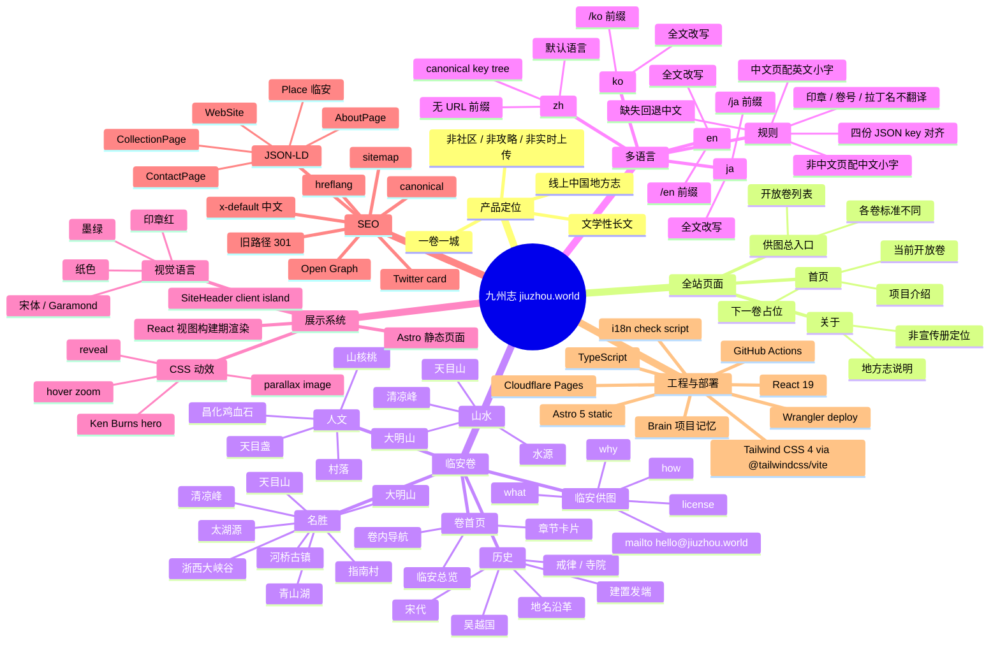

# Feature Mindmap

```mermaid
mindmap
  root((九州志 jiuzhou.world))
    产品定位
      一卷一城
      线上中国地方志
      文学性长文
      非社区 / 非攻略 / 非实时上传
    全站页面
      首页
        项目介绍
        当前开放卷
        下一卷占位
      关于
        地方志说明
        非宣传册定位
      供图总入口
        开放卷列表
        各卷标准不同
    临安卷
      卷首页
        临安总览
        章节卡片
        卷内导航
      山水
        天目山
        大明山
        清凉峰
        水源
      名胜
        天目山
        大明山
        青山湖
        浙西大峡谷
        太湖源
        指南村
        河桥古镇
        清凉峰
      历史
        建置发端
        吴越国
        宋代
        戒律 / 寺院
        地名沿革
      人文
        山核桃
        昌化鸡血石
        天目盏
        村落
      临安供图
        why
        what
        how
        license
        mailto hello@jiuzhou.world
    多语言
      zh
        默认语言
        无 URL 前缀
        canonical key tree
      en
        /en 前缀
        全文改写
      ja
        /ja 前缀
        全文改写
      ko
        /ko 前缀
        全文改写
      规则
        缺失回退中文
        四份 JSON key 对齐
        印章 / 卷号 / 拉丁名不翻译
        中文页配英文小字
        非中文页配中文小字
    展示系统
      Astro 静态页面
      React 视图构建期渲染
      SiteHeader client island
      CSS 动效
        reveal
        Ken Burns hero
        hover zoom
        parallax image
      视觉语言
        纸色
        墨绿
        印章红
        宋体 / Garamond
    SEO
      canonical
      hreflang
      x-default 中文
      sitemap
      Open Graph
      Twitter card
      JSON-LD
        WebSite
        AboutPage
        CollectionPage
        ContactPage
        Place 临安
      旧路径 301
    工程与部署
      Astro 5 static
      React 19
      Tailwind CSS 4 via @tailwindcss/vite
      TypeScript
      GitHub Actions
      Cloudflare Pages
      Wrangler deploy
      i18n check script
      Brain 项目记忆
```
