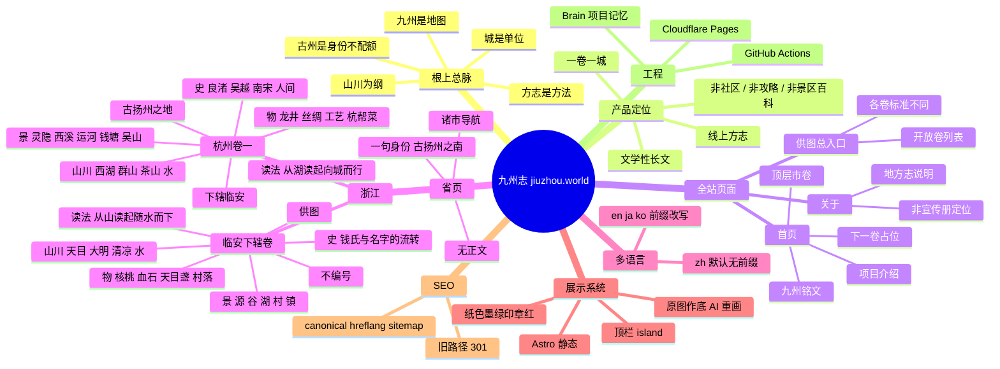

# Feature mindmap

```mermaid
mindmap
  root((九州志 jiuzhou.world))
    根上总脉
      山川为纲
      九州是地图
      方志是方法
      城是单位
      古州是身份不配额
    产品定位
      一卷一城
      线上方志
      文学性长文
      非社区 / 非攻略 / 非景区百科
    全站页面
      首页
        九州铭文
        项目介绍
        顶层市卷
        下一卷占位
      关于
        地方志说明
        非宣传册定位
      供图总入口
        开放卷列表
        各卷标准不同
    浙江
      省页
        一句身份 古扬州之南
        诸市导航
        无正文
      杭州卷一
        读法 从湖读起向城而行
        山川 西湖 群山 茶山 水
        景 灵隐 西溪 运河 钱塘 吴山
        物 龙井 丝绸 工艺 杭帮菜
        史 良渚 吴越 南宋 人间
        下辖临安
        古扬州之地
      临安下辖卷
        读法 从山读起随水而下
        山川 天目 大明 清凉 水
        景 源 谷 湖 村 镇
        物 核桃 血石 天目盏 村落
        史 钱氏与名字的流转
        不编号
        供图
    多语言
      zh 默认无前缀
      en ja ko 前缀改写
    展示系统
      Astro 静态
      顶栏 island
      纸色墨绿印章红
      原图作底 AI 重画
    SEO
      canonical hreflang sitemap
      旧路径 301
    工程
      GitHub Actions
      Cloudflare Pages
      Brain 项目记忆
```
