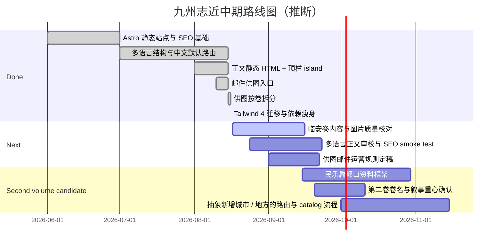

# Roadmap

当前项目已经从“单页/原型”进入“静态多语言地方志站点”阶段。最近提交集中在：静态 HTML + 顶栏 island、i18n polish、供图按卷拆分、README 与 Tailwind 4 / 依赖瘦身。后续最合理的路线是先把临安卷打磨成稳定样板，再围绕第二卷候选 **民乐扁都口** 做资料框架（见 [[second-volume-candidate-minle-biandukou]]）。

## 近期优先级

1. **临安卷样板打磨**
   - 校对山水、名胜、历史、人文四章的事实、语气、图片 alt 与移动端阅读体验。
   - 保证临安是未来新增城市 / 地方可复制的“卷模板”。

2. **多语言质量门槛**
   - 继续保持 `npm run i18n:check` 作为 CI 门禁。
   - 人工检查英文 / 日文 / 韩文是否是自然改写，而不是生硬对译。
   - 抽查 canonical、hreflang、JSON-LD、sitemap 与旧路径 301。

3. **供图运营闭环**
   - 明确 `hello@jiuzhou.world` 的收信、分拣、授权确认与选用流程。
   - 决定后续是否仍用 mailto，或引入更正式但仍轻量的表单。

4. **第二卷候选：民乐扁都口**
   - 暂作为第二卷优先候选，而非最终决定。
   - 先确认卷名是“民乐”还是“扁都口”，以及这一卷到底以故乡记忆、河西走廊地理、祁连山口，还是景观游览为核心。
   - 如果最终确定，应优先整理：河西走廊、祁连山、扁都口、民乐县、油菜花海、山口通道、地方记忆与用户自有素材。

## 不建议过早做的事

- 在第二卷卷名与叙事重心未确定前引入 CMS / 数据库。
- 在供图量没有验证前做账号、上传、审核后台。
- 把站点改成客户端 SPA；这会削弱当前静态阅读与 SEO 优势。

## 开放问题

- 第二卷最终是“民乐卷”还是“扁都口卷”？
- 临安卷是否要先做一次事实校勘 / 图片版权校勘，再进入第二卷？
