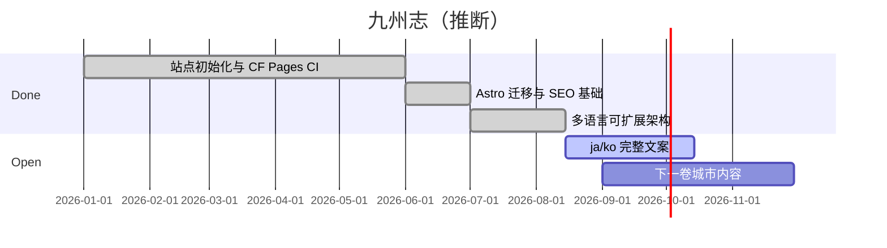

# Roadmap

从现有代码与 README 可确认的已完成项；后续里程碑需产品方确认，以下仅为占位。

```mermaid
gantt
  title 九州志（推断）
  dateFormat  YYYY-MM-DD
  section Done
  站点初始化与 CF Pages CI     :done, 2026-01-01, 2026-06-01
  Astro 迁移与 SEO 基础        :done, 2026-06-01, 2026-07-01
  多语言可扩展架构             :done, 2026-07-01, 2026-08-15
  section Open
  ja/ko 完整文案               :active, 2026-08-15, 60d
  下一卷城市内容               :2026-09-01, 90d
```

## 开放问题
- 下一卷城市是哪一座？
- 内容更新是手工 Markdown/TS 还是引入 CMS？
