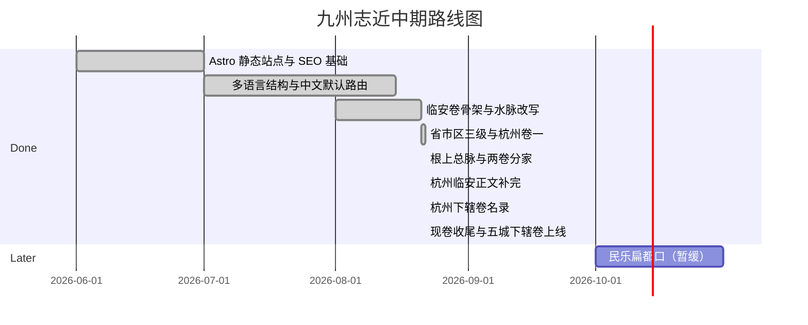

# Roadmap

当前项目是「山川为纲的多级方志」。总图见 [[anthology-spine]]。杭州卷一与临安下辖卷已落地。可立五城（富阳、桐庐、建德、淳安、萧山）已挂站点，见 [[hangzhou-subvolumes-roster]]。民乐扁都口 **暂缓**。

```mermaid
gantt
  title 九州志近中期路线图
  dateFormat  YYYY-MM-DD
  section Done
  Astro 静态站点与 SEO 基础           :done, 2026-06-01, 2026-07-01
  多语言结构与中文默认路由             :done, 2026-07-01, 2026-08-15
  临安卷骨架与水脉改写                 :done, 2026-08-01, 2026-08-21
  省市区三级与杭州卷一                 :done, 2026-08-21, 2026-08-22
  根上总脉与两卷分家                   :done, 2026-08-22, 2026-08-22
  杭州临安正文补完                     :done, 2026-08-22, 2026-08-22
  杭州下辖卷名录                       :done, 2026-08-22, 2026-08-22
  现卷收尾与五城下辖卷上线             :done, 2026-08-22, 2026-08-22

  section Later
  民乐扁都口（暂缓）                   :2026-10-01, 30d
```

## 近期优先级

1. **已完成**：物之卷过场、缘起山川为纲；富阳 / 桐庐 / 建德 / 淳安 / 萧山下辖卷上线。
2. **扁都口暂缓**。

## 不建议过早做的事

- 把首页九州铭文做成可点的分卷地图
- 在下一座城未定前引入 CMS / 数据库
- 页上为未开的区摆空位
- 本轮写民乐 / 扁都口

## 开放问题

- 五卷密度可再按临安天目标尺加厚
